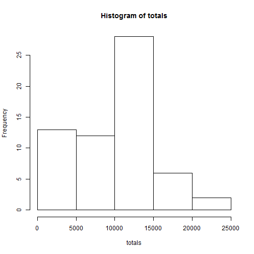
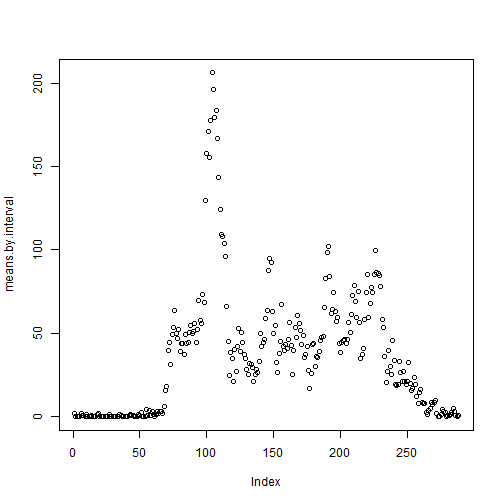
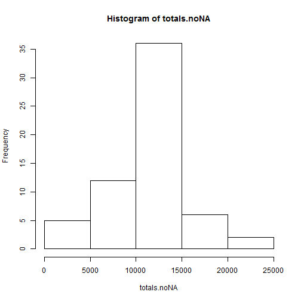
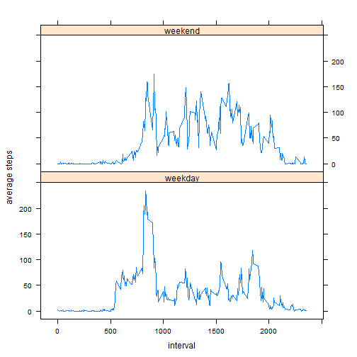

#Loading and preprocessing the data

```r
dat=read.csv("activity.csv")
summary(dat)
```

```
##      steps                date          interval     
##  Min.   :  0.00   2012-10-01:  288   Min.   :   0.0  
##  1st Qu.:  0.00   2012-10-02:  288   1st Qu.: 588.8  
##  Median :  0.00   2012-10-03:  288   Median :1177.5  
##  Mean   : 37.38   2012-10-04:  288   Mean   :1177.5  
##  3rd Qu.: 12.00   2012-10-05:  288   3rd Qu.:1766.2  
##  Max.   :806.00   2012-10-06:  288   Max.   :2355.0  
##  NA's   :2304     (Other)   :15840
```
What is mean total number of steps taken per day?

```r
totals=tapply(dat$steps, dat$date, sum, na.rm=T)
hist(totals)
```

 

```r
means=tapply(dat$steps, dat$date, mean, na.rm=T)
medians=tapply(dat$steps, dat$date, median, na.rm=T)
means.by.interval=tapply(dat$steps, dat$interval, mean, na.rm=T)
plot(means.by.interval)
```

 

```r
means.by.interval[which(means.by.interval==max(means.by.interval))] #max
```

```
##      835 
## 206.1698
```
Imputing missing values
Number missing

```r
sum(is.na(dat$steps))
```

```
## [1] 2304
```
Fill NAs

```r
dat.noNA=dat
dat.noNA$steps[is.na(dat.noNA$steps)]=
  means.by.interval[as.character(dat.noNA$interval[is.na(dat.noNA$steps)])]
totals.noNA=tapply(dat.noNA$steps, dat.noNA$date, sum, na.rm=t)
hist(totals.noNA)
```

 

Does it change anything?


```r
c(mean(dat.noNA$steps), median(dat.noNA$steps), mean(dat$steps,na.rm=T), median(dat$steps,na.rm=T))
```

```
## [1] 37.3826  0.0000 37.3826  0.0000
```
Nothing changes because of the filling methodology.

Are there differences in activity patterns between weekdays and weekends?

```r
dat$weekday=ifelse(weekdays(as.Date(dat$date))%in%c("Saturday","Sunday"), "weekend","weekday")
require(lattice)
plot.data=tapply(dat$steps, list(dat$interval, dat$weekday), mean,na.rm=T)
require(reshape)
plot.data=melt(plot.data)

xyplot(value~X1|X2, plot.data, type="l", layout=c(1,2),xlab="interval", ylab="average steps")
```

 
